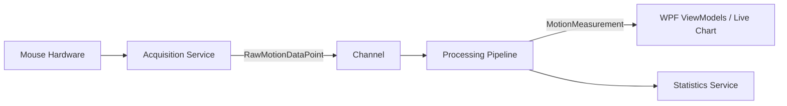

# MotionLab

MotionLab is a prototype Windows desktop application that demonstrates data acquisition (DAQ), real-time kinematics processing, and statistical analysis. It uses a standard computer mouse as an accessible, low-cost motion sensor to capture real-world movement and kinematic properties.

## Motivation

This project serves as a demonstration of software engineering concepts relevant to instrumentation and physical testing software:
- Windows GUI development (WPF, MVVM)
- Hardware abstraction
- Asynchronous data acquisition
- Channel-based producer/consumer data pipelines
- Real-time visualisation
- Kinematic and statistical analysis
- Scientific data export

A standard computer mouse provides an excellent proxy for more specialised industrial sensors (like hardware encoders or displacement transducers). It allows for repeatable testing across various surfaces to observe relative motion characteristics.

## Architecture

The application is built in C# (.NET 8) utilising a clean MVVM architecture. The data flow relies on `System.Threading.Channels` to decouple real-time hardware acquisition from the data processing pipeline and the UI.

**Data Flow:**

### Hardware Abstraction

The `IMotionSensor` interface decouples the application logic from the physical sensor. 
Currently, the application includes:
- `MouseMotionSensor`: Interfaces with Win32 APIs (`GetCursorPos`) to read cursor movement.
- `SimulatedMotionSensor`: Generates deterministic motion data for development and unit testing without physical hardware.

This design ensures the `MouseMotionSensor` can be swapped for an `EncoderMotionSensor` or a `DAQMotionSensor` with zero changes to the underlying analysis logic or view models.

### Concurrency and Timing

Acquisition runs on a dedicated background thread, polling the sensor at high frequency (~100 Hz). To account for the variability of the Windows thread scheduler, the system uses `System.Diagnostics.Stopwatch` to capture high-resolution elapsed time. Velocity is computed using the exact elapsed time between successive samples ($\Delta \text{Displacement} / \Delta t$) rather than assuming a rigid time interval, maintaining mathematical accuracy regardless of polling jitter.

## The Experiment

The application allows users to perform repeatable physical motion experiments:
1. Place the mouse on a selected surface (e.g., Wooden Desk, Mouse Mat, Fabric).
2. Start the test and move the mouse through a repeatable path.
3. Observe live displacement and velocity kinetics.
4. Compare statistical results across different surfaces to analyse motion behaviour.

## Measurements

MotionLab distinguishes between raw measurements and derived kinematics:

- **Raw Measurements**: Read directly from the sensor, comprising a high-resolution `Timestamp` and raw integer displacement deltas (`DeltaX`, `DeltaY`) in sensor-specific units (e.g., mickeys).
- **Derived Kinematics**: The processing pipeline applies a calibration factor to convert raw units into physical distance, and calculates cumulative displacement and instantaneous velocity.
- **Statistical Results**: After the test completes, the application aggregates peak velocity, mean velocity, standard deviation, and coefficient of variation.

## Scientific Limitations

This application is technically honest about what it measures:
- The system **measures cursor kinematics** (displacement, velocity, elapsed time).
- It **does not directly measure physical force**, mechanical load, or coefficient of friction.
- "Stick-slip" events are detected algorithmically based on characteristic motion patterns (sudden velocity drops followed by peaks), not via physical tension measurement.
- The physical displacement measurements rely entirely on user calibration.

This is a prototype instrumentation/DAQ demonstration, not a calibrated industrial measurement instrument.

## Technology Stack

- C# 12 / .NET 8
- Windows Presentation Foundation (WPF)
- MVVM Architecture (`CommunityToolkit.Mvvm`)
- `System.Threading.Channels`
- `OxyPlot.Wpf` (Live Real-time Charting)
- `Microsoft.Extensions.DependencyInjection`
- `System.Text.Json` (Data Export)
- xUnit (Unit Testing)
